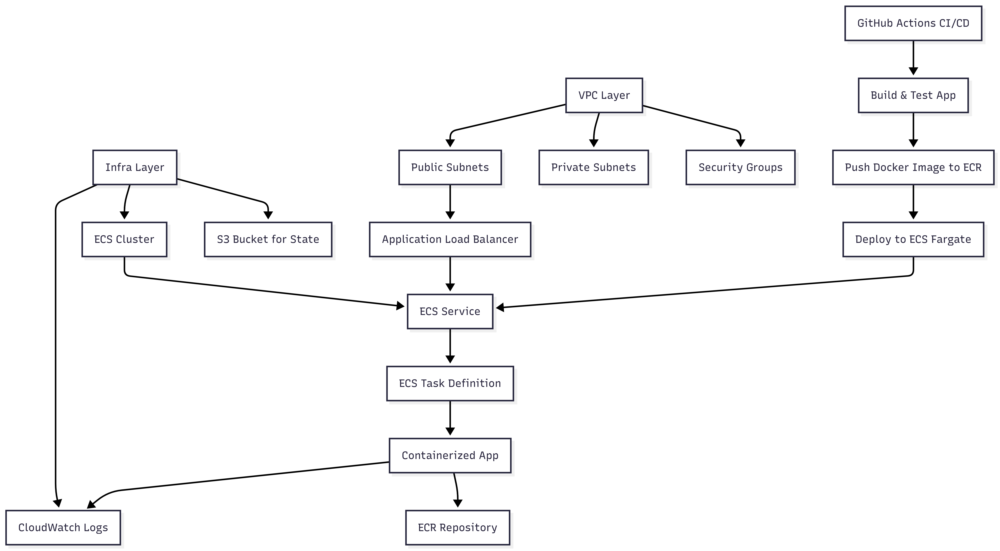

# DevOps: Production-Ready Application Deployment

This repository demonstrates a complete DevOps pipeline for deploying a containerized web application on AWS using Infrastructure as Code (Terraform), CI/CD (GitHub Actions), and monitoring (CloudWatch). It includes VPC, ECS (Fargate), ECR, S3, and a simple Node.js app.

## Architecture Overview

The architecture follows a layered, modular approach for scalability and maintainability:
- **Network Layer (VPC)**: Isolated AWS network with public/private subnets and security groups. Provides a secure foundation for resources.
- **Infrastructure Layer (Infra)**: Deploys app services (ECS), storage (S3), and monitoring. Depends on VPC outputs for networking.
- **Application Layer**: Containerized Node.js app running on ECS Fargate, accessible via ALB. CI/CD automates updates.
- **Why Layer Separation?**: Allows independent scaling, testing, and deployment. E.g., network changes don't disrupt app releases. State separation prevents lock conflicts and enables parallel workflows.



## Structure

```
terraform-deploy/
├── app/           # Simple Node.js web app with Dockerfile
├── vpc/           # Root config for VPC/networking (separate state)
├── infra/         # Root config for ECS, S3, etc. (separate state)
├── terraform/modules/
│   ├── ecs/       # ECS cluster, service, task, ALB
│   └── s3/
├── cloudformation/
│   └── bootstrap.yml  # OIDC, S3 backend, DynamoDB
├── .github/
│   └── workflows/
│       ├── app-deploy.yml          # App CI/CD: build, test, deploy to ECS
│       ├── cloudformation-deploy.yml # Bootstrap CloudFormation
│       ├── terraform-deploy.yml     # Deploy VPC and infra
│       ├── terraform-infra-plan.yml # Plan infra changes
│       └── terraform-vpc-infra.yml  # VPC and infra workflows
└── README.md
```

## State Management

- **VPC and infra have separate state files** using S3 backends, with dynamic bucket names based on AWS account and region.
- The infra stack uses `terraform_remote_state` to read outputs from the VPC stack.

## Deployment Steps

1. **Bootstrap AWS Resources**
   - Deploy CloudFormation: `aws cloudformation deploy --template-file cloudformation/bootstrap.yml --stack-name devops-challenge-bootstrap --capabilities CAPABILITY_NAMED_IAM`

2. **Configure Repository Secrets/Variables**
   - Set `AWS_OIDC_ROLE_ARN`, `AWS_ACCOUNT_ID` in GitHub secrets.
   - Set `AWS_REGION` in GitHub variables (default: us-east-1).

3. **Deploy Infrastructure**
   - VPC: Run `terraform-deploy.yml` workflow with action `apply`.
   - Infra: Run after VPC, with action `apply`.

4. **Deploy Application**
   - Push to main branch or run `app-deploy.yml` manually.
   - App will be available at the ALB DNS (output from infra).

## Design Decisions

### Infrastructure Choices
- **ECS Fargate over EC2/ECS EC2**: Fargate provides serverless container orchestration, eliminating the need to manage EC2 instances. This reduces operational overhead, improves scalability (auto-handles capacity), and lowers costs by charging only for used resources. EC2 was considered but deemed less efficient for a containerized app without additional management.
- **ALB (Application Load Balancer)**: Placed in front of ECS for load balancing, SSL termination, and secure public access. It routes traffic to the Fargate tasks without exposing them directly, enhancing security and availability.
- **Security group separation**: ALB and ECS tasks each have dedicated security groups, enforcing least-privilege traffic flows and improving network segmentation.
- **CloudWatch for Monitoring/Logging**: Integrated natively with ECS/Fargate for real-time logs and metrics. Chosen over external tools like Prometheus for simplicity and AWS-native integration, ensuring production readiness without extra setup.

### Layer Separation (VPC, Infra)
- **Split into VPC and Infra Layers**: The VPC layer handles networking (subnets, security groups) separately from the infra layer (ECS, S3). This separation allows independent management, e.g., network changes without affecting app deployment. It also enables modular state management, reducing blast radius if one layer fails. State files are split to avoid monolithic Terraform runs, improving speed and error isolation.
- **Modular Terraform Modules**: ECS and S3 are in reusable modules, promoting DRY (Don't Repeat Yourself) principles. This makes the code maintainable and adaptable for other projects.

### Automation and CI/CD
- **GitHub Actions for CI/CD**: Selected for its tight integration with GitHub repos, ease of use, and no external tool costs. It automates the entire pipeline (build, test, deploy), ensuring repeatability and reducing manual errors. Workflows use OIDC for secure AWS access without storing credentials.
- **Multiple Workflows**: 
  - `terraform-vpc-infra.yml` and `terraform-deploy.yml`: Separate VPC and infra deployments to sequence dependencies (VPC first, then infra). This prevents circular dependencies and allows targeted updates.
  - `terraform-infra-plan.yml`: Runs plans on PRs for review, catching issues early without applying changes.
  - `app-deploy.yml`: Dedicated to app CI/CD, triggered on code pushes. It builds/tests the app, pushes images to ECR, and updates ECS—keeping infra and app pipelines distinct for clarity and parallel execution.
  - `cloudformation-deploy.yml`: Handles one-time bootstrap, separate from ongoing infra to avoid re-running it unnecessarily.
- **Why Automation?**: Manual deployments are error-prone and not repeatable. Automation via GitHub Actions ensures consistent environments, faster iterations, and compliance with DevOps best practices for production systems.

### Bootstrap and CloudFormation Nuances
- **CloudFormation for Bootstrap**: Used for initial AWS resources (OIDC provider, IAM roles, S3 backend, DynamoDB lock table) because Terraform can't create its own state backend securely. CloudFormation is AWS-native, idempotent, and handles cross-account setups well. It's run once per account/region, providing a secure foundation.
- **Nuances**: OIDC enables passwordless GitHub-to-AWS access, improving security. Dynamic S3/DynamoDB names (based on account/region) ensure isolation. This setup avoids hardcoded ARNs and supports multi-environment deployments without conflicts.

### Other Decisions
- **Simple Node.js App**: Meets the challenge's requirement for a sample application. Containerized for portability and ECS compatibility.
- **Region Configurability**: Variables allow easy region changes, avoiding hardcoding for flexibility.
- **No External Tools**: Kept everything within AWS and GitHub to minimize dependencies and simplify evaluation.


## Improvements

- ECS auto-scaling was implemented using target-tracking scaling on CPU utilization.
- ALB target group health checks with response matcher, interval, timeout, and threshold settings.
- The GitHub Actions app pipeline runs `npm test` before image build and push, ensuring basic functional verification.

Posible future improvements include adding more comprehensive service-level tests, enhanced security hardening, and multi-region deployment support.

## Security
- **No secrets or sensitive values are hardcoded or stored in this repository.**
- All secrets (AWS credentials, OIDC role ARNs, etc.) must be provided via environment variables or CI/CD secrets store.
- The .gitignore excludes tfstate, tfvars, and other sensitive/ephemeral files.

## Modules

- `ecs`: Provisions ECS cluster, service, task definition, ALB, ECR, IAM roles.
- `s3`: Manages S3 buckets.

## CloudFormation
- `cloudformation/bootstrap.yml` provisions OIDC provider, IAM roles, S3 backend, and DynamoDB lock table for Terraform state. This is a one-time setup to enable secure, automated Terraform runs without manual AWS creds. Nuances include dynamic resource naming for multi-account support and OIDC for GitHub integration, ensuring no secrets are stored in code.

## CI/CD
The CI/CD pipelines leverage GitHub Actions for full automation, ensuring repeatable deployments and early issue detection. Workflows are separated by concern to avoid conflicts and enable parallel execution (see Design Decisions for rationale).

- **terraform-vpc-infra.yml & terraform-deploy.yml**: Handle infrastructure provisioning. VPC deploys first (network layer), followed by infra (app layer). Uses Terraform actions for plan/apply, with OIDC for secure AWS access. Runs on manual triggers or PRs.
- **terraform-infra-plan.yml**: Runs Terraform plan on infra changes for review, preventing unintended applies.
- **app-deploy.yml**: App-specific pipeline—builds/tests the Node.js app, creates Docker image, pushes to ECR, and force-deploys to ECS. Triggered on main branch pushes for continuous deployment.
- **cloudformation-deploy.yml**: One-time bootstrap for foundational resources. Separate to avoid re-running during regular deployments.

Automation reduces manual toil, ensures consistency, and supports rapid iterations in a production environment.


## Notes
- Region is configurable via variables (default: us-east-1).
- All resources are tagged for environment and management.
- No hardcoded secrets or credentials.

---

